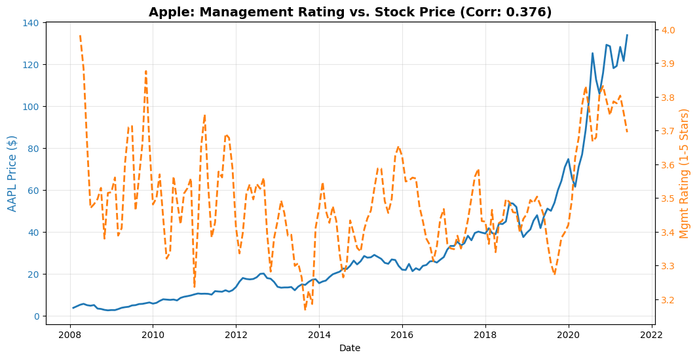

# glassdoor sentiment alpha

an exploratory notebook asking whether employee sentiment can reveal changes in corporate health before they appear in the market.

  
  

## the question

traditional financial reporting is delayed. employees may notice leadership problems, budget pressure, or falling morale before those issues appear in an earnings report.

this project explores whether historical glassdoor reviews, especially ratings for senior management, move alongside later changes in public-market performance.

## what i tried

- cleaned and aggregated historical glassdoor review data
- focused on senior management ratings as a proxy for internal confidence
- aligned monthly sentiment with historical market data from yahoo finance
- visualized rating and price trends over time
- explored sentiment features for a future earnings-surprise classifier

## early result

in the apple sample shown above, monthly senior management ratings and stock price had a correlation of `0.376`.

that is an interesting exploratory signal, not proof of causation or a trading strategy. stock prices trend over time, review volume varies, and a useful predictive test would need out-of-sample validation across more companies and market regimes.

## run it

open [`glassdoor_sentiment_alpha.ipynb`](glassdoor_sentiment_alpha.ipynb) in colab using the badge above.

the notebook expects a local file named `glassdoor_reviews.csv`. the source dataset is [glassdoor job reviews on kaggle](https://www.kaggle.com/datasets/davidgauthier/glassdoor-job-reviews), which is not committed to this repository.

## built with

python, pandas, numpy, matplotlib, seaborn, scikit-learn, vader sentiment, and yfinance.

## next steps

- replace raw price levels with forward returns
- add time-aware train and test splits
- evaluate multiple companies instead of a single case study
- control for review volume and sector effects
- compare vader with a finance-focused language model

## note

this repository is an educational research project, not financial advice.
